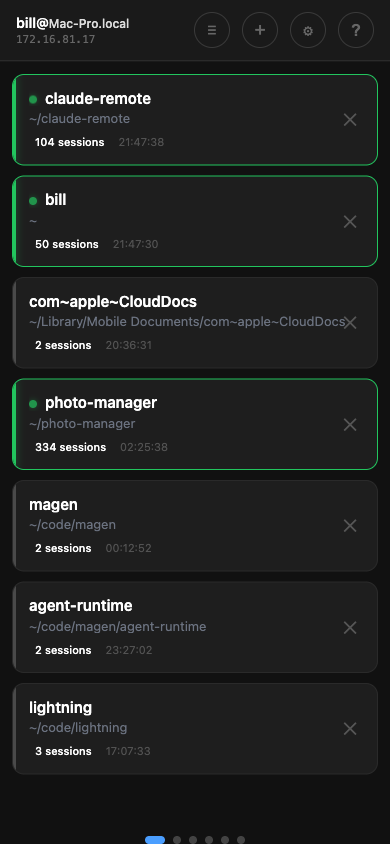
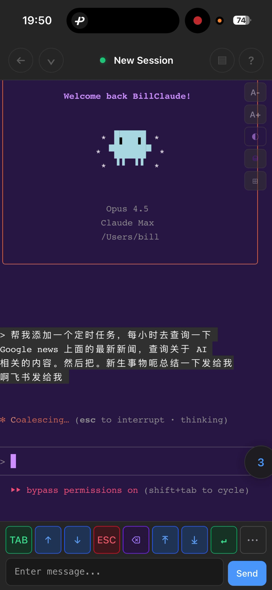
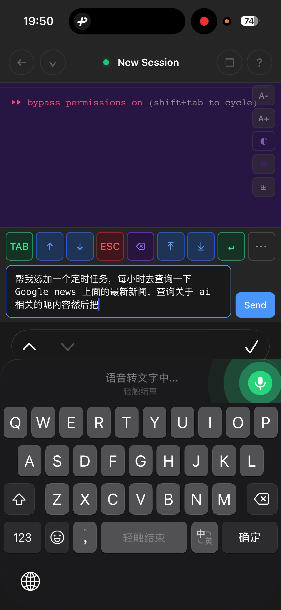
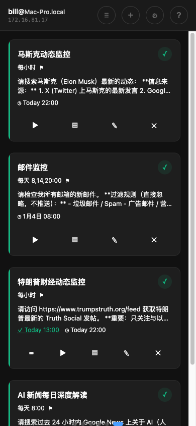
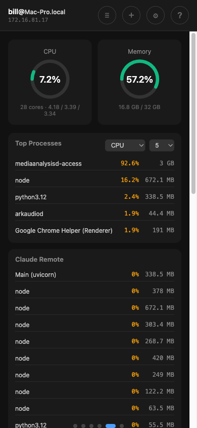
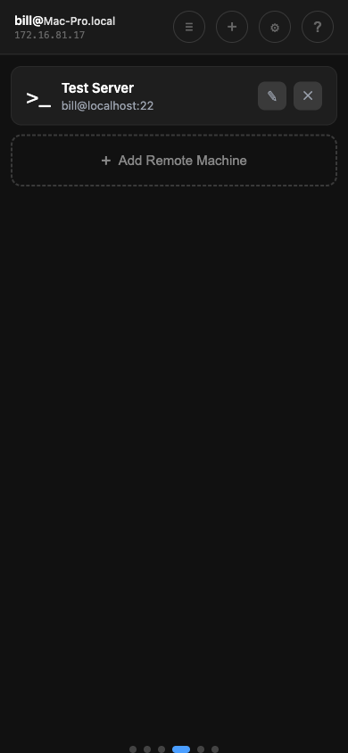

# Hello, Jarvis

[](https://opensource.org/licenses/Apache-2.0)
[](https://www.python.org/)

**English** | [中文](README_CN.md)

> Not a tool. An intelligent assistant that works for you.

<p align="center">
  
</p>

---

## What is Jarvis?

**Jarvis is not a tool — it's an agent.**

A tool waits for you to operate it. An agent understands your intent, makes plans, and executes autonomously.

```
Tool:    Human → operates → Computer
Agent:   Human → delegates → Jarvis → commands → Computer
```

Like Tony Stark's JARVIS, you don't "use" it — you talk to it, assign tasks, and let it work.

---

## Core Capability: Task Delegation

The essence of Jarvis is **delegation** — you give instructions, Jarvis executes.

### Instant Tasks

Assign a task anytime, from anywhere:

```
You: "Check if the production server has enough disk space"
Jarvis: [connects to server, runs commands, analyzes results]
Jarvis: "Server is at 73% capacity. The logs directory is taking 45GB. Should I clean up logs older than 7 days?"
```

### Scheduled Tasks

Set up recurring tasks that run automatically:

- **Daily briefing**: "Every morning at 8am, summarize my unread emails and Slack messages"
- **Monitoring**: "Every hour, check if our API response time exceeds 500ms"
- **Research**: "Every Monday, find and summarize AI news from the past week"

Jarvis executes in the background. You receive results via notification (Feishu/Lark, or other channels via MCP).

### Agent-to-Agent Collaboration

The real power: **one agent can assign tasks to another**.

While working with Claude Code on your computer:
```
You: "This refactoring will take a while. Have another agent monitor our Slack for any urgent messages and notify me."
```

Claude Code → creates a scheduled task → another Jarvis agent monitors Slack → alerts you if needed.

**You're not managing tools. You're commanding a team of AI agents.**

### The Future: Multi-Agent Orchestration

Today's scheduled tasks are just the beginning. The vision:

- **Workflow chains**: Agent A finishes → triggers Agent B → results feed Agent C
- **Parallel execution**: Multiple agents working on different aspects simultaneously
- **Specialized agents**: Research agent, coding agent, communication agent — each with their strengths
- **Collaborative problem-solving**: Agents discussing and iterating together

---

## Philosophy

### The Terminal Is Just a Log

**Old thinking:**
```
You → UI/Terminal → Computer executes
      (Terminal is the main character)
```

**New thinking:**
```
You → Voice → Jarvis → Execute tasks
                 ↓
        Terminal is just "execution log"
```

You're not "using a computer" — you're "talking to Jarvis". The computer is just Jarvis's hands and feet.

### The Five Pillars

| # | Element | Role | Function |
|---|---------|------|----------|
| 1 | **Computer** | Body | Where work happens |
| 2 | **Claude** | Soul | Thinks, plans, executes |
| 3 | **Jarvis** | Voice | Your command channel to AI |
| 4 | **You** | Commander | Directs, reviews, decides |
| 5 | **Context** | Memory | Your preferences, history, knowledge |

### Be AI-Native

**Generational shift:**
- **Digital Immigrant**: Learned to use computers
- **Digital Native**: Born knowing computers
- **AI-Native**: Treats AI as an extension of self

**AI-native mindset:**
- "I'll have Jarvis handle this, I'll just review"
- Your capabilities = Your skills + AI's skills
- Work mode: Commander + Reviewer, not Executor

---

## Use Cases

Jarvis is a general-purpose assistant. Programming is just one of many things it can do.

### 🤖 Personal Assistant

| Task | Example |
|------|---------|
| Information gathering | "Summarize today's AI news" |
| Email triage | "Find urgent emails and draft responses" |
| Research | "Compare the top 5 project management tools" |
| Reminders | "Every Friday, remind me to submit my timesheet" |

### 💻 Software Development

| Task | Example |
|------|---------|
| Coding | "Add error handling to the upload function" |
| Code review | "Review this PR and suggest improvements" |
| Debugging | "Find why the login test is failing" |
| Documentation | "Generate API docs for this module" |

### 🖥️ System Administration

| Task | Example |
|------|---------|
| Monitoring | "Alert me if CPU exceeds 80%" |
| Maintenance | "Clean up Docker images older than 30 days" |
| Deployment | "Deploy the latest build to staging" |
| Troubleshooting | "Check why the service is slow" |

### 📊 Data & Analysis

| Task | Example |
|------|---------|
| Data processing | "Parse these logs and find error patterns" |
| Reporting | "Generate weekly metrics report" |
| Automation | "Every day, backup the database to S3" |

---

## Access Methods

### 📱 Mobile (Primary)

Control Jarvis from your phone — the most natural way to delegate:

- **Voice input**: Speak your instructions
- **Anywhere access**: On the subway, in bed, during a walk
- **Fragment time**: 5 minutes is enough to assign a task

### 🖥️ Desktop

Full terminal experience when you need it:

- **Multi-session**: Run multiple agents in parallel
- **Direct interaction**: For complex, interactive tasks

### 🔌 API / MCP

Programmatic access for automation:

- **MCP Server**: Integrate with Claude Code and other MCP clients
- **REST API**: Build your own integrations

---

## Quick Start

### Prerequisites

- macOS or Linux
- Python 3.10+
- [Claude Code](https://docs.anthropic.com/en/docs/claude-code) installed and authenticated

### Installation

```bash
# Clone the repository
git clone https://github.com/AndrewChen2013/jarvis.git
cd jarvis

# Run management script
chmod +x deploy/manage.sh
./deploy/manage.sh
```

**First Run:** The script will automatically:
- Create Python virtual environment
- Install dependencies
- Generate a random AUTH_TOKEN
- Start the service

**Subsequent Runs:** Shows an interactive menu:

```
  1) Start service
  2) Stop service
  3) Restart service
  4) View logs

  5) Enable auto-start on boot
  6) Disable auto-start on boot

  7) Reinstall dependencies

  0) Exit
```

**Features:**
- Service management (start/stop/restart)
- Real-time log viewing
- Auto-start on boot (macOS LaunchAgent / Linux systemd)
- Dependency installation and updates

### Access

**Local Network:**
```
http://<your-computer-ip>:8000
```

**Remote Access (Optional):**

If you need access from outside your local network, [Cloudflare Tunnel](https://developers.cloudflare.com/cloudflare-one/connections/connect-networks/) is one simple option:

```bash
# Install cloudflared
brew install cloudflared

# Create tunnel
cloudflared tunnel create jarvis

# Configure tunnel (edit ~/.cloudflared/config.yml)
tunnel: <tunnel-id>
credentials-file: ~/.cloudflared/<tunnel-id>.json

ingress:
  - hostname: claude.yourdomain.com
    service: http://localhost:8000
  - service: http_status:404

# Start tunnel
cloudflared tunnel run jarvis
```

Now access from anywhere: `https://claude.yourdomain.com`

> ⚠️ **Security Warning**
> - Exposing services to the internet carries inherent risks
> - If you're on a corporate network, **consult your network administrator** before setting up any tunnel
> - Consider your organization's security policies and compliance requirements
> - Use strong AUTH_TOKEN and rotate it periodically

---

## Usage

### Login

Enter your AUTH_TOKEN (shown during installation or in `.env` file).

### Project Management



Organize your work by project:

- **Project cards**: See all projects with session counts
- **Active indicator**: Green dot shows projects with active sessions
- **Quick access**: Tap a project to see its sessions

### Session Management


- **Create new session**: Tap `+`, select working directory
- **Resume existing session**: Browse your Claude history and continue
- **Multiple sessions**: Switch between sessions with the floating button
- **Pin sessions**: Long press to pin important sessions to the top
- **Token tracking**: See total tokens used and context window usage for each session

### Terminal



Full terminal experience on mobile:
- **Virtual keys**: Tab, ↑↓, ESC, Backspace, and more
- **Combo keys**: ^L (clear), ^O (verbose), ^B (background), ESC×2 (rollback), ⇧Tab (mode)
- **Slash commands**: /resume, /clear, /help, /compact, /memory
- **Touch scroll**: Smooth scrolling with momentum
- **Font size**: A+/A- buttons, each session remembers its own size

### Voice Input



1. Tap the input field
2. Tap the microphone icon on your keyboard
3. Speak your instruction
4. Send

### Scheduled Tasks



Automate recurring tasks with cron-based scheduling:

- **Create tasks**: Define prompts that run on a schedule (hourly, daily, weekly)
- **Feishu notifications**: Get task results sent to Feishu/Lark automatically
- **MCP integration**: Use the `jarvis-tasks` MCP server to manage tasks from Claude Code
- **Execution history**: View past runs and their outputs
- **Manual trigger**: Run any task immediately with one tap

Example use cases:
- Monitor news and send daily summaries
- Check emails and filter important ones
- Track social media updates
- Run periodic system health checks

### System Monitor



Real-time system monitoring:

- **CPU & Memory**: Live usage with visual gauges
- **Top Processes**: Sort by CPU or memory, configurable count
- **Jarvis processes**: See all related processes
- **Disk Usage**: Monitor all mounted volumes

### SSH Remote Machines



Connect to remote servers via SSH:

- **Add machines**: Configure SSH host, port, username, and key
- **Quick connect**: One-tap to open SSH terminal
- **Manage connections**: Edit or delete saved machines

---

## Features

| Category | Capabilities |
|----------|--------------|
| **Task Execution** | Scheduled tasks, MCP integration, Feishu notifications, execution history |
| **Multi-Session** | Background sessions, parallel agents, session switching |
| **Mobile Experience** | Touch scroll, virtual keyboard, voice input, font scaling |
| **System Tools** | System monitor, SSH remote machines, file management |
| **Integrations** | 9 languages, Cloudflare Tunnel, token auth |

---

## Configuration

Edit `.env` file:

```bash
# Authentication (required)
AUTH_TOKEN=your-secret-token
```

> The AUTH_TOKEN is auto-generated on first run. You can change it anytime in Settings.

### MCP Server for Scheduled Tasks

To enable Claude Code to manage scheduled tasks, add the MCP server to your Claude Code configuration:

**Location:** `~/.claude/claude_desktop_config.json` (or your Claude Code config)

```json
{
  "mcpServers": {
    "jarvis-tasks": {
      "command": "python",
      "args": ["/path/to/jarvis/app/mcp/scheduled_tasks_mcp.py"],
      "env": {
        "JARVIS_URL": "http://localhost:8000",
        "JARVIS_TOKEN": "your-auth-token"
      }
    }
  }
}
```

**Available MCP Tools:**
- `create_scheduled_task` — Create a new scheduled task
- `list_scheduled_tasks` — List all tasks
- `get_scheduled_task` — Get task details
- `update_scheduled_task` — Modify a task
- `delete_scheduled_task` — Remove a task
- `toggle_scheduled_task` — Enable/disable a task
- `run_scheduled_task_now` — Execute immediately
- `get_task_executions` — View execution history

---

## Service Management

### macOS

```bash
# Start
launchctl start com.jarvis.backend

# Stop
launchctl stop com.jarvis.backend

# View logs
tail -f ~/jarvis/logs/backend.log
```

### Linux

```bash
# Start
sudo systemctl start jarvis

# Stop
sudo systemctl stop jarvis

# View logs
sudo journalctl -u jarvis -f
```

---

## Security Notes

1. **Use strong AUTH_TOKEN** — This is your only authentication
2. **Use Cloudflare Tunnel** — Don't expose port 8000 directly to internet
3. **Firewall** — Only allow local access if not using tunnel
4. **HTTPS** — Cloudflare Tunnel provides this automatically

---

## Troubleshooting

### Can't connect?
- Check if service is running: `curl http://localhost:8000/health`
- Check AUTH_TOKEN matches
- Check firewall settings

### Session won't start?
- Verify Claude Code is installed: `which claude`
- Check logs: `~/jarvis/logs/backend.error.log`

### Mobile display issues?
- Try adjusting font size with A+/A- buttons
- Refresh the page if terminal doesn't render

---

## License

Apache License, Version 2.0

---

## Author

Bill Chen

---

<p align="center">
  <i>Don't operate. Delegate.<br>
  Your AI team is ready.</i>
</p>
