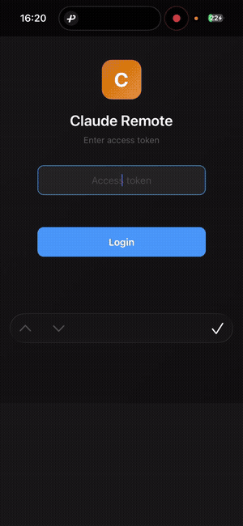
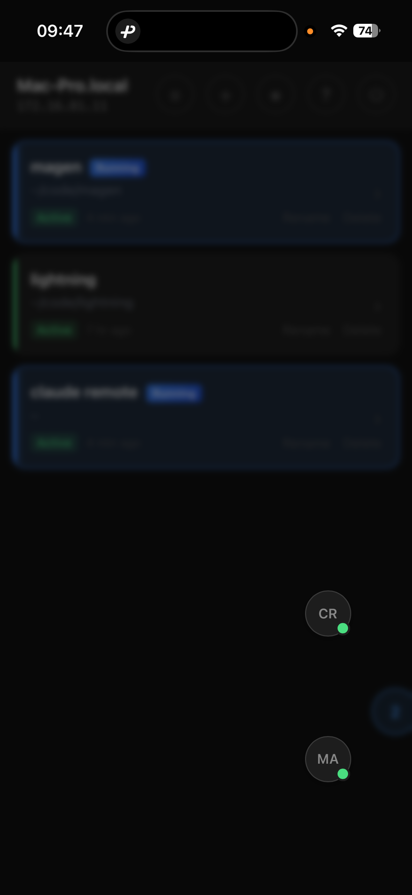
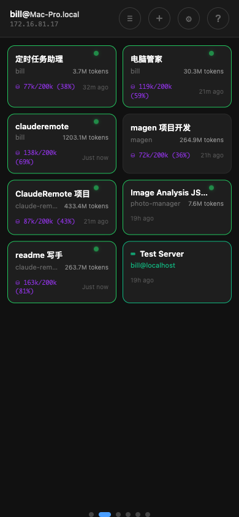

# Claude Remote

[](https://opensource.org/licenses/Apache-2.0)
[](https://www.python.org/)

[English](README.md) | **中文**

> 用自然语言，随时随地控制你的电脑。

<p align="center">
  
</p>

---

## 解放

```
封建时代，农民被禁锢在土地上
工业时代，工人被禁锢在流水线上
信息时代，码农被禁锢在工位上

AI 时代，是时候解放了。
```

**解放空间** — 不再被工位束缚
**解放时间** — 5 分钟碎片时间也能干活
**解放双手** — 语音输入，动口不动手
**解放思想** — 专注创造，执行交给 AI

---

## 理念

### 自然语言控制一切

**传统方式：**
```
你 → 学习各种命令 → 电脑
     (ssh, git, grep, find, curl, docker...)
     (记不住，容易错)
```

**新方式：**
```
你 → 自然语言 → Claude → 电脑
     ("帮我看看昨天的日志有没有报错")
     (Claude 自己知道用什么命令)
```

Claude 成为你和电脑之间的**翻译层**：
- 你说人话，Claude 翻译成机器指令
- 不需要记住任何命令语法
- 不需要担心拼写错误
- 只要 Claude 能理解你的意图就行

**Claude 能做什么？**
- 写代码、改 bug、跑测试
- 查文件、搜日志、看配置
- 发请求、调 API、执行脚本
- 操作 git、管理进程、部署服务
- **一切命令行能做的事**

**你需要做什么？**
- 只需要表达意图
- "帮我看看 nginx 日志最近有没有 500 错误"
- "把这个项目打包部署到测试环境"
- "查一下数据库里用户表有多少条记录"

**不用纠结命令对不对，只要 Claude 能理解就行。**

### 把时间留给思考

Claude 处理执行——命令、语法、繁琐细节。你专注于真正重要的事：想法、架构、创造力。

AI 时代，**想象力才是你最大的资产**。不要把它浪费在记忆参数和选项上。让 Claude 做你的翻译官，把心智留给只有人类能做的事：**想象、创造、革新**。

---

## 氛围编程

一种新的编程方式：

- **想到** → **说出来** → **走开** → **回来看结果**
- 你的工作：思考、决策、创造
- Claude 的工作：执行、翻译、实现

### 碎片化时间编程

传统编程需要大块时间 —— 至少 1-2 小时才能"进入状态"。

用 Claude Remote：
- **5 分钟**就能推进项目
- 等电梯？看一眼进度
- 等外卖？给个反馈
- 地铁上？下个新指令
- **不需要"进入状态"**—— Claude 保持着上下文

碎片时间累积起来 = **真正的生产力**。

### 多 Session 并行

Claude 有 70% 的时间在输出。等待就是浪费。



同时跑 3-4 个任务：
- Session A 正在生成 → 切到 Session B，下指令
- Session B 正在思考 → 切到 Session C，看输出
- Session C 完成了 → 回到 Session A，继续

**一个人，3-4 倍效率。**

### 语音驱动

手机输入法自带语音识别。

- 说话代替打字
- 闭着眼睛，躺着，也能编程
- "帮我把登录页面的表单验证加上" → 发送 → 完事

**真正的解放双手。**

### 自举开发

这个项目本身就是用 Claude Remote 开发的。核心功能完成后，后续所有功能都是用手机语音输入完成的——通勤时、走路时、躺床上。这就是氛围编程的最好证明。

---

## 快速开始

### 前置条件

- macOS 或 Linux
- Python 3.10+
- [Claude Code](https://docs.anthropic.com/en/docs/claude-code) 已安装并登录

### 安装

```bash
# 克隆项目
git clone https://github.com/AndrewChen2013/claude-remote.git
cd claude-remote

# 运行管理脚本
chmod +x deploy/manage.sh
./deploy/manage.sh
```

**首次运行：** 脚本会自动：
- 创建 Python 虚拟环境
- 安装依赖
- 生成随机 AUTH_TOKEN
- 启动服务

**后续运行：** 显示交互式菜单：

```
  1) 启动服务
  2) 停止服务
  3) 重启服务
  4) 查看日志

  5) 启用开机自启动
  6) 禁用开机自启动

  7) 重新安装依赖

  0) 退出
```

**功能特性：**
- 服务管理（启动/停止/重启）
- 实时日志查看
- 开机自启动（macOS LaunchAgent / Linux systemd）
- 依赖安装与更新

### 访问

**局域网访问：**
```
http://<你的电脑IP>:8000
```

**外网访问（可选）：**

如果需要从外网访问，[Cloudflare Tunnel](https://developers.cloudflare.com/cloudflare-one/connections/connect-networks/) 是一个简单的实现方案：

```bash
# 安装 cloudflared
brew install cloudflared

# 创建隧道
cloudflared tunnel create claude-remote

# 配置隧道（编辑 ~/.cloudflared/config.yml）
tunnel: <tunnel-id>
credentials-file: ~/.cloudflared/<tunnel-id>.json

ingress:
  - hostname: claude.你的域名.com
    service: http://localhost:8000
  - service: http_status:404

# 启动隧道
cloudflared tunnel run claude-remote
```

现在可以从任何地方访问：`https://claude.你的域名.com`

> ⚠️ **安全警告**
> - 将服务暴露到公网存在固有风险
> - 如果在公司办公网络，**请先与网管沟通**，确认符合公司安全策略
> - 充分考虑你所在组织的安全政策和合规要求
> - 使用强密码作为 AUTH_TOKEN，并定期更换

---

## 使用方法

### 登录

输入 AUTH_TOKEN（安装时显示，或查看 `.env` 文件）。

### 会话管理



- **创建新会话**：点击 `+`，选择工作目录
- **恢复历史会话**：浏览 Claude 历史记录，继续之前的对话
- **多会话切换**：使用悬浮按钮在会话间切换

### 终端操作


移动端完整终端体验：
- **虚拟按键**：Tab、↑↓、Ctrl+C、ESC 等
- **斜杠命令**：/resume、/clear、/help、/compact
- **触摸滚动**：带惯性的平滑滚动
- **字体大小**：可调节，适应你的喜好

### 语音输入

1. 点击输入框
2. 点击键盘上的麦克风图标
3. 说出你的指令
4. 发送

---

## 使用场景

| 场景 | 示例 |
|------|------|
| **继续编程** | "给上传功能加上错误处理" |
| **查看进度** | "到哪一步了？给我看看" |
| **系统运维** | "服务器磁盘空间够不够？" |
| **文件操作** | "找出项目里所有的 TODO 注释" |
| **Git 操作** | "建个分支，把这些改动提交了" |
| **快速查询** | "配置文件的结构是什么样的？" |

---

## 配置说明

编辑 `.env` 文件：

```bash
# 认证（必填）
AUTH_TOKEN=你的密码

# 会话限制
MAX_ACTIVE_SESSIONS=10        # 最大同时会话数
SESSION_IDLE_TIMEOUT=7200     # 闲置 2 小时后自动休眠

# 资源限制
MAX_PROCESS_MEMORY_MB=2048    # 单会话内存限制
MAX_PROCESS_CPU_PERCENT=80    # 单会话 CPU 限制
```

---

## 服务管理

### macOS

```bash
# 启动
launchctl start com.claude.remote.backend

# 停止
launchctl stop com.claude.remote.backend

# 查看日志
tail -f ~/claude-remote/logs/backend.log
```

### Linux

```bash
# 启动
sudo systemctl start claude-remote

# 停止
sudo systemctl stop claude-remote

# 查看日志
sudo journalctl -u claude-remote -f
```

---

## 安全建议

1. **使用强密码** — AUTH_TOKEN 是唯一的认证方式
2. **使用 Cloudflare Tunnel** — 不要直接把 8000 端口暴露到公网
3. **防火墙** — 如果不用隧道，只允许本地访问
4. **HTTPS** — Cloudflare Tunnel 自动提供 HTTPS

---

## 常见问题

### 连不上？
- 检查服务是否运行：`curl http://localhost:8000/health`
- 检查 AUTH_TOKEN 是否正确
- 检查防火墙设置

### 会话启动失败？
- 确认 Claude Code 已安装：`which claude`
- 查看日志：`~/claude-remote/logs/backend.error.log`

### 手机显示异常？
- 尝试用 A+/A- 按钮调整字体大小
- 刷新页面重新加载终端

---

## 许可证

Apache License, Version 2.0

---

## 作者

Bill Chen

---

<p align="center">
  <i>编程的本质是思考，不是敲键盘。<br>
  让思想自由驰骋。</i>
</p>
