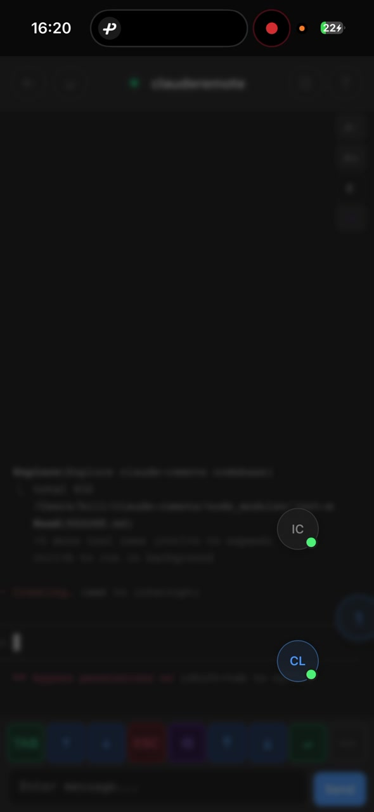
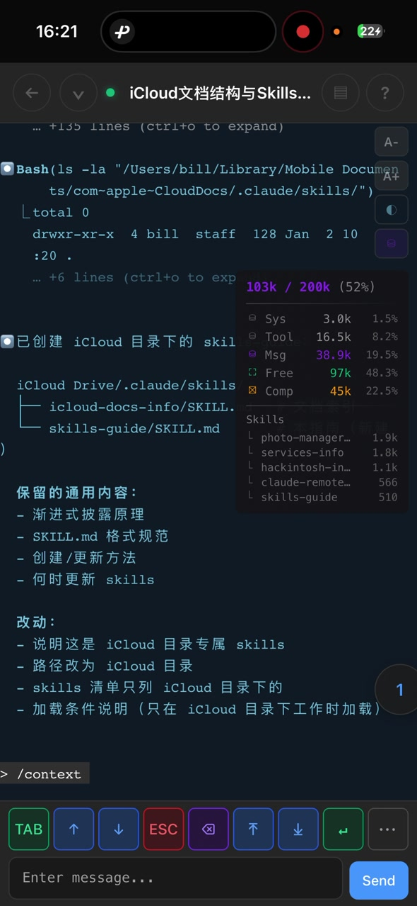

# Hello, Jarvis

[](https://opensource.org/licenses/Apache-2.0)
[](https://www.python.org/)

[English](README.md) | **中文**

> 你的个人 AI 助手。用自然语言，随时随地控制你的电脑。

<p align="center">
  
</p>

---

## 解放

```
封建时代，农民被禁锢在土地上
工业时代，工人被禁锢在流水线上
信息时代，码农被禁锢在工位上

AI 时代，是时候解放了。
```

**解放空间** — 不再被工位束缚
**解放时间** — 5 分钟碎片时间也能干活
**解放双手** — 语音输入，动口不动手
**解放思想** — 专注创造，执行交给 AI

---

## 理念

### 终端只是后台日志

**旧思维：**
```
人 → 操作界面 → 电脑执行（终端是主角）
```

**新思维：**
```
人 → 语音 → 贾维斯 → 执行任务
                ↓
           终端只是「执行日志」
```

**真正的交互模式：**
- **前台**：你的语音 / 自然语言
- **中台**：贾维斯理解、规划、决策
- **后台**：Claude Code 执行（终端日志）
- **反馈**：语音汇报 / 必要时才看日志

**你不是在「用电脑」，你是在「跟贾维斯说话」，电脑只是贾维斯的手脚。**

### AI 的执行带宽碾压人类

**人类操作电脑的瓶颈：**
```
人脑 → 神经信号 → 手指 → 键盘/鼠标 → 屏幕像素 → 眼睛 → 人脑
```

**AI 操作电脑：**
```
AI → API/命令行 → 系统直接执行
```

| 维度 | 人类 | AI |
|------|------|-----|
| 输入方式 | 键盘鼠标（串行） | 命令/API（并行） |
| 速度 | 秒级 | 毫秒级 |
| 精确度 | 会手滑、会漏 | 精确执行 |
| 并发 | 一次一件事 | 同时操作多个 |
| 疲劳 | 会累、会走神 | 不会 |

**本质洞察**：人类和电脑之间隔着「肉体」这个低带宽接口。AI 和电脑之间是「原生数字」对话，没有这层损耗。

### 贾维斯系统的五大支柱

| # | 要素 | 比喻 | 解决什么问题 |
|---|------|------|--------------|
| 1 | **电脑** | 身体 | 工作在哪里发生 |
| 2 | **Claude** | 灵魂 | 谁来思考和执行（知识渊博 + 有执行力的外挂大脑） |
| 3 | **Jarvis** | 嘴巴 | 人→AI 的指令通道（打破空间限制） |
| 4 | **AI-native 的人** | 主人 | 谁来驾驭这一切 |
| 5 | **上下文数字化** | 记忆 | AI→理解人 的信息通道（高带宽传递） |

### 成为 AI-native

**代际对比：**
- **Digital Immigrant**：学会用电脑的人（70后、60后）
- **Digital Native**：生来就会用电脑的人（90后、00后）
- **AI-native**：把 AI 当成自己能力延伸的人

**AI-native 的特征：**
- 思维方式变了：「这事我让贾维斯搞定，我审核一下」
- 能力边界变了：自己会的 + AI 会的
- 工作方式变了：从执行者变成指挥官 + 审核者

**定义**：不是「学会用 AI 工具的人」，而是「用 AI 重构了自己工作方式的人」

---

## 氛围编程

一种新的编程方式：

- **想到** → **说出来** → **走开** → **回来看结果**
- 你的工作：思考、决策、创造
- Claude 的工作：执行、翻译、实现

### 碎片化时间编程

传统编程需要大块时间 —— 至少 1-2 小时才能"进入状态"。

用 Jarvis：
- **5 分钟**就能推进项目
- 等电梯？看一眼进度
- 等外卖？给个反馈
- 地铁上？下个新指令
- **不需要"进入状态"**—— Claude 保持着上下文

碎片时间累积起来 = **真正的生产力**。

### 多 Session 并行

Claude 有 70% 的时间在输出。等待就是浪费。



同时跑 3-4 个任务：
- Session A 正在生成 → 切到 Session B，下指令
- Session B 正在思考 → 切到 Session C，看输出
- Session C 完成了 → 回到 Session A，继续

**一个人，3-4 倍效率。**

### 语音驱动

手机输入法自带语音识别。

- 说话代替打字
- 闭着眼睛，躺着，也能编程
- "帮我把登录页面的表单验证加上" → 发送 → 完事

**真正的解放双手。**

### 自举开发

这个项目本身就是用 Jarvis 开发的。核心功能完成后，后续所有功能都是用手机语音输入完成的——通勤时、走路时、躺床上。

**你看到的一切都是 Claude Code 创造的：**
- 📝 这份 README — 撰写和翻译
- 🎬 演示 GIF — 从录屏中提取帧，自动合成
- 🖼️ 所有截图 — 提取、裁剪、敏感信息打码
- 🌍 9 种语言翻译 — 每种语言 200+ 条目

这就是氛围编程的最好证明。

---

## 快速开始

### 前置条件

- macOS 或 Linux
- Python 3.10+
- [Claude Code](https://docs.anthropic.com/en/docs/claude-code) 已安装并登录

### 安装

```bash
# 克隆项目
git clone https://github.com/AndrewChen2013/jarvis.git
cd jarvis

# 运行管理脚本
chmod +x deploy/manage.sh
./deploy/manage.sh
```

**首次运行：** 脚本会自动：
- 创建 Python 虚拟环境
- 安装依赖
- 生成随机 AUTH_TOKEN
- 启动服务

**后续运行：** 显示交互式菜单：

```
  1) 启动服务
  2) 停止服务
  3) 重启服务
  4) 查看日志

  5) 启用开机自启动
  6) 禁用开机自启动

  7) 重新安装依赖

  0) 退出
```

**功能特性：**
- 服务管理（启动/停止/重启）
- 实时日志查看
- 开机自启动（macOS LaunchAgent / Linux systemd）
- 依赖安装与更新

### 访问

**局域网访问：**
```
http://<你的电脑IP>:8000
```

**外网访问（可选）：**

如果需要从外网访问，[Cloudflare Tunnel](https://developers.cloudflare.com/cloudflare-one/connections/connect-networks/) 是一个简单的实现方案：

```bash
# 安装 cloudflared
brew install cloudflared

# 创建隧道
cloudflared tunnel create jarvis

# 配置隧道（编辑 ~/.cloudflared/config.yml）
tunnel: <tunnel-id>
credentials-file: ~/.cloudflared/<tunnel-id>.json

ingress:
  - hostname: claude.你的域名.com
    service: http://localhost:8000
  - service: http_status:404

# 启动隧道
cloudflared tunnel run jarvis
```

现在可以从任何地方访问：`https://claude.你的域名.com`

> ⚠️ **安全警告**
> - 将服务暴露到公网存在固有风险
> - 如果在公司办公网络，**请先与网管沟通**，确认符合公司安全策略
> - 充分考虑你所在组织的安全政策和合规要求
> - 使用强密码作为 AUTH_TOKEN，并定期更换

---

## 使用方法

### 登录

输入 AUTH_TOKEN（安装时显示，或查看 `.env` 文件）。

### 项目管理


按项目组织你的工作：

- **项目卡片**：查看所有项目及会话数量
- **活跃指示**：绿点表示有活跃会话的项目
- **快速访问**：点击项目查看其会话

### 会话管理


- **创建新会话**：点击 `+`，选择工作目录
- **恢复历史会话**：浏览 Claude 历史记录，继续之前的对话
- **多会话切换**：使用悬浮按钮在会话间切换
- **置顶会话**：长按会话卡片，将重要会话置顶
- **Token 统计**：查看每个会话的总 Token 用量和上下文窗口使用情况

### 终端操作


移动端完整终端体验：
- **虚拟按键**：Tab、↑↓、ESC、退格键等
- **组合键**：^L（清屏）、^O（详细输出）、^B（后台）、ESC×2（回滚）、⇧Tab（切换模式）
- **斜杠命令**：/resume、/clear、/help、/compact、/memory
- **触摸滚动**：带惯性的平滑滚动
- **字体大小**：A+/A- 按钮，每个会话独立记忆

### 语音输入


1. 点击输入框
2. 点击键盘上的麦克风图标
3. 说出你的指令
4. 发送

### 定时任务


基于 cron 表达式的定时任务自动化：

- **创建任务**：设置按计划运行的 prompt（每小时、每天、每周）
- **飞书通知**：任务结果自动发送到飞书/Lark
- **MCP 集成**：通过 `jarvis-tasks` MCP 服务器在 Claude Code 中管理任务
- **执行历史**：查看过去的运行记录和输出
- **手动触发**：一键立即运行任何任务

使用场景示例：
- 监控新闻并发送每日摘要
- 检查邮件并过滤重要内容
- 跟踪社交媒体动态
- 定期运行系统健康检查

### 系统监控


实时系统监控：

- **CPU 和内存**：可视化仪表盘显示实时使用率
- **进程列表**：按 CPU 或内存排序，可配置显示数量
- **Jarvis 进程**：查看所有相关进程
- **磁盘使用**：监控所有挂载的磁盘

### SSH 远程机器


通过 SSH 连接远程服务器：

- **添加机器**：配置 SSH 主机、端口、用户名和密钥
- **快速连接**：一键打开 SSH 终端
- **管理连接**：编辑或删除已保存的机器

---

## 使用场景

| 场景 | 示例 |
|------|------|
| **继续编程** | "给上传功能加上错误处理" |
| **查看进度** | "到哪一步了？给我看看" |
| **系统运维** | "服务器磁盘空间够不够？" |
| **文件操作** | "找出项目里所有的 TODO 注释" |
| **Git 操作** | "建个分支，把这些改动提交了" |
| **快速查询** | "配置文件的结构是什么样的？" |
| **定时监控** | 设置每小时新闻监控，飞书推送通知 |
| **远程服务器** | SSH 连接到服务器执行命令 |
| **文件传输** | 从手机上传配置文件 |

---

## 功能特性

### 📱 移动端优化体验

- **触摸滚动** — 流畅的惯性滚动，像原生应用一样自然
- **虚拟键盘** — 专为终端设计的快捷键面板，无需切换输入法
- **字体缩放** — A+/A- 按钮随时调整，每个会话独立记忆
- **下拉刷新** — 轻拉刷新数据，重拉刷新页面
- **软键盘适配** — 工具栏始终可见，不会被键盘遮挡

### 🔀 多会话管理

- **后台保持连接** — 切换会话时不断开，Claude 继续在后台运行
- **悬浮切换按钮** — 一键在多个会话间快速跳转
- **收起到后台** — 暂时离开但保持连接，随时恢复
- **会话重命名** — 给会话起个好记的名字
- **删除会话** — 清理不需要的历史记录

### ⌨️ 快捷操作

**常用按键**

| 按键 | 功能 |
|------|------|
| TAB | 自动补全 |
| ↑ ↓ | 历史命令 |
| ESC | 停止当前操作 |
| ⤒ ⤓ | 滚动到顶部/底部（长按连续滚动）|

**组合键**

| 按键 | 功能 |
|------|------|
| ^L | 清屏 |
| ^O | 显示详细输出 |
| ^B | 后台运行 |
| ESC×2 | 回滚上次操作 |
| ⇧Tab | 切换模式 |

**斜杠命令**

| 命令 | 功能 |
|------|------|
| /resume | 恢复会话 |
| /clear | 清空对话 |
| /compact | 压缩上下文 |
| /memory | 查看记忆 |
| /help | 帮助信息 |

### 📊 用量监控



- **实时用量** — 查看 5 小时周期和 7 天周期的使用情况
- **Sonnet 额度** — 单独显示 Sonnet 模型用量
- **Context 信息** — 当前会话的 token 消耗、剩余空间、距离压缩
- **账户信息** — 显示套餐类型和连接状态

### 🌐 多语言支持

- 9 种语言：中文、英文、日语、韩语、法语、德语、西班牙语、俄语、葡萄牙语
- 随时切换，设置自动保存

### ⏰ 定时任务 & MCP 服务器

- **Cron 定时调度** — 每小时、每天、每周或自定义计划运行任务
- **飞书/Lark 通知** — 自动将任务结果发送到聊天
- **MCP 集成** — 通过内置 MCP 服务器在 Claude Code 中管理任务
- **执行历史** — 查看过去的运行记录、输出和状态
- **会话关联** — 每个任务可以创建专属的 Claude Code 会话

### 📊 系统监控

- **实时 CPU 和内存** — 可视化仪表盘显示实时使用率
- **进程列表** — 按 CPU 或内存排序的进程列表
- **磁盘使用** — 监控所有挂载的磁盘
- **Jarvis 统计** — 查看所有相关进程及其资源使用情况

### 🖥️ SSH 远程机器

- **保存连接** — 存储 SSH 主机、端口、用户名和密钥路径
- **快速连接** — 一键打开终端会话
- **集成终端** — 完整的 xterm.js 终端体验

### 📁 文件管理

- **文件浏览器** — 浏览你的文件系统
- **文件上传** — 从手机上传文件到任意目录
- **上传历史** — 跟踪最近上传的文件，快速复制路径
- **文件下载** — 直接下载文件到你的设备

### 🔐 安全访问

- **Token 认证** — 首次运行自动生成随机访问令牌
- **修改密码** — 随时更换访问令牌
- **远程访问** — 支持 Cloudflare Tunnel 安全暴露

---

## 配置说明

编辑 `.env` 文件：

```bash
# 认证（必填）
AUTH_TOKEN=你的密码
```

> AUTH_TOKEN 会在首次运行时自动生成。可以随时在设置中修改。

### 定时任务 MCP 服务器

要让 Claude Code 能够管理定时任务，需要将 MCP 服务器添加到 Claude Code 配置中：

**配置文件位置：** `~/.claude/claude_desktop_config.json`（或你的 Claude Code 配置文件）

```json
{
  "mcpServers": {
    "jarvis-tasks": {
      "command": "python",
      "args": ["/path/to/jarvis/app/mcp/scheduled_tasks_mcp.py"],
      "env": {
        "JARVIS_URL": "http://localhost:8000",
        "JARVIS_TOKEN": "你的访问令牌"
      }
    }
  }
}
```

**可用的 MCP 工具：**
- `create_scheduled_task` — 创建新的定时任务
- `list_scheduled_tasks` — 列出所有任务
- `get_scheduled_task` — 获取任务详情
- `update_scheduled_task` — 修改任务
- `delete_scheduled_task` — 删除任务
- `toggle_scheduled_task` — 启用/禁用任务
- `run_scheduled_task_now` — 立即执行
- `get_task_executions` — 查看执行历史

---

## 服务管理

### macOS

```bash
# 启动
launchctl start com.jarvis.backend

# 停止
launchctl stop com.jarvis.backend

# 查看日志
tail -f ~/jarvis/logs/backend.log
```

### Linux

```bash
# 启动
sudo systemctl start jarvis

# 停止
sudo systemctl stop jarvis

# 查看日志
sudo journalctl -u jarvis -f
```

---

## 安全建议

1. **使用强密码** — AUTH_TOKEN 是唯一的认证方式
2. **使用 Cloudflare Tunnel** — 不要直接把 8000 端口暴露到公网
3. **防火墙** — 如果不用隧道，只允许本地访问
4. **HTTPS** — Cloudflare Tunnel 自动提供 HTTPS

---

## 常见问题

### 连不上？
- 检查服务是否运行：`curl http://localhost:8000/health`
- 检查 AUTH_TOKEN 是否正确
- 检查防火墙设置

### 会话启动失败？
- 确认 Claude Code 已安装：`which claude`
- 查看日志：`~/jarvis/logs/backend.error.log`

### 手机显示异常？
- 尝试用 A+/A- 按钮调整字体大小
- 刷新页面重新加载终端

---

## 许可证

Apache License, Version 2.0

---

## 作者

Bill Chen

---

<p align="center">
  <i>编程的本质是思考，不是敲键盘。<br>
  让思想自由驰骋。</i>
</p>
